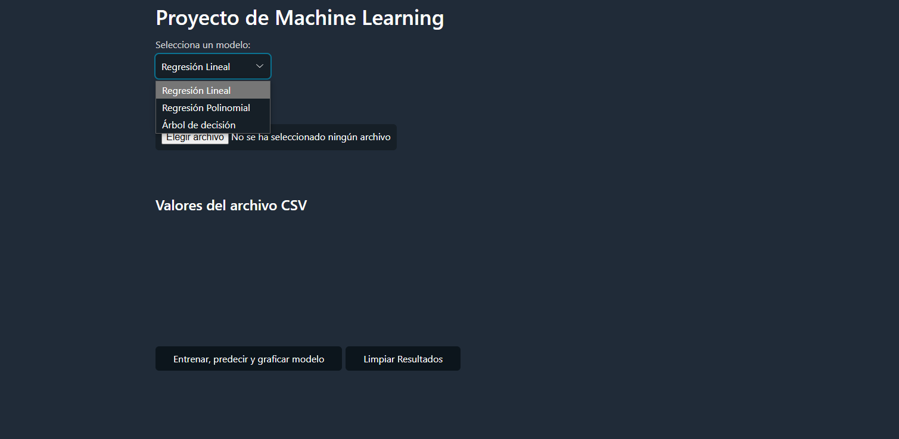
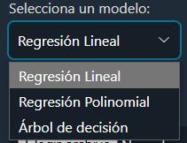
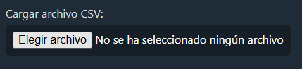
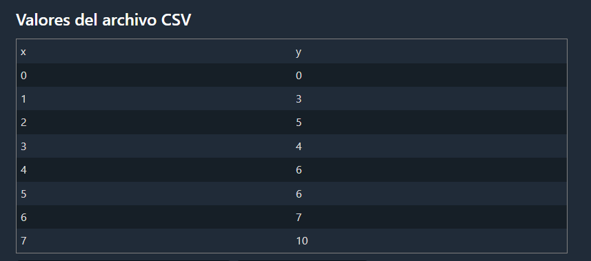
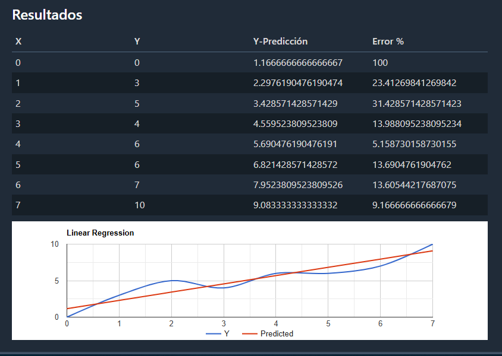
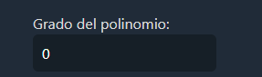

# Manual de Usuario para el Proyecto de Machine Learning

Este manual de usuario proporciona instrucciones detalladas sobre cómo utilizar la aplicación web del Proyecto de Machine Learning. La aplicación permite cargar archivos CSV, entrenar modelos de regresión y visualizar los resultados en forma de tablas y gráficos.

## Interfaz de Usuario

La interfaz de usuario consta de varias secciones que permiten al usuario interactuar con la aplicación. A continuación se describen los elementos principales de la interfaz:

1. **Selección de Modelo**: El usuario puede elegir entre tres modelos de regresión diferentes:
   - Regresión Lineal
   - Regresión Polinomial
   - Árbol de Decisión

    

2. **Carga de Archivo CSV**: El usuario puede cargar un archivo CSV con los datos de entrada para entrenar el modelo seleccionado. Los datos deben estar en formato CSV y contener al menos dos columnas: una para las variables independientes y otra para la variable dependiente.

    

Al cargar un archivo CSV, el sistema mostrará una tabla con los datos cargados y permitirá al usuario visualizarlos y realizar modificaciones si es necesario.

3. **Entrenamiento del Modelo**: Una vez cargados los datos, el usuario puede entrenar el modelo seleccionado haciendo clic en el botón "Entrenar Modelo". El sistema mostrará el resultado del entrenamiento y permitirá al usuario realizar predicciones con los datos de entrada.

    

4. **Visualización de Resultados**: Una vez entrenado el modelo, el sistema mostrará los resultados en forma de gráficos y tablas. 

5. Campos adicionales: El usuario puede ingresar valores adicionales estos servirian como parametros para algunos de los modelos de regresion. Por ejemplo en el caso de la regresion polinomial el usuario puede ingresar el grado del polinomio.

    

Y el programa mostrara los resultados en una tabla y en un grafico como se muestra indico anteriormente.

